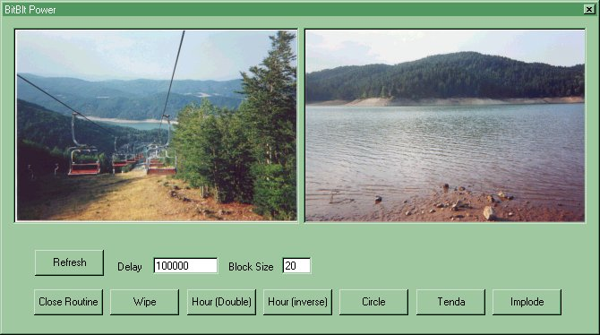



## Power of BitBlt Unleashed

### Description

This code show the power of the bitblt Api function creating beautiful transition effects (Wipe in, Circle, Implode etc). We use some math function. We write this code in our spare time, so forgive any mistake. (Code comments soon)

Please vote for us.

Calaminici Davide & Alessio Pierotti
 
### More Info
 
read the read me file

Beautiful graphis effects

             |
---                |---
**Submitted On**   |2000-12-06 21:57:14
**By**             |[Amiga Blitter](https://github.com/Planet-Source-Code/PSCIndex/blob/master/ByAuthor/amiga-blitter.md)
**Level**          |Advanced
**User Rating**    |4.2 (25 globes from 6 users)
**Compatibility**  |VB 4\.0 \(32\-bit\), VB 5\.0, VB 6\.0
**Category**       |[Graphics](https://github.com/Planet-Source-Code/PSCIndex/blob/master/ByCategory/graphics__1-46.md)
**World**          |[Visual Basic](https://github.com/Planet-Source-Code/PSCIndex/blob/master/ByWorld/visual-basic.md)
**Archive File**   |[CODE\_UPLOAD124401272000\.zip](https://github.com/Planet-Source-Code/amiga-blitter-power-of-bitblt-unleashed__1-13409/archive/master.zip)

### API Declarations

BitBlt

